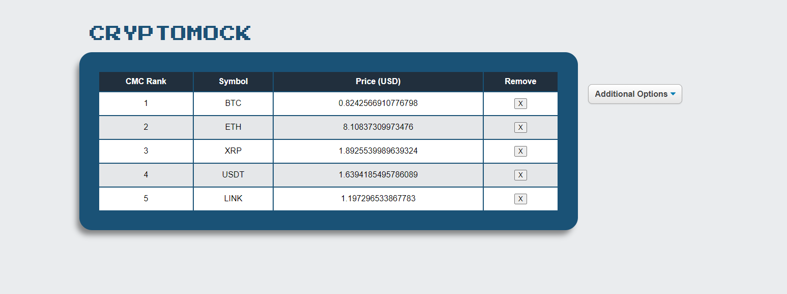
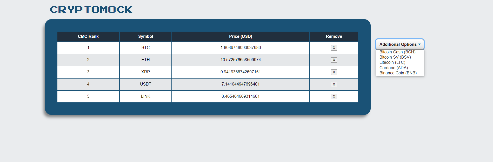
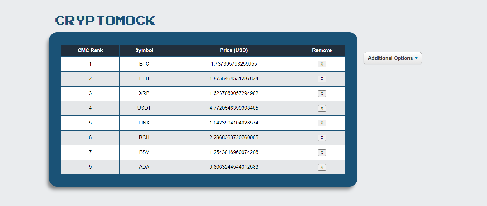
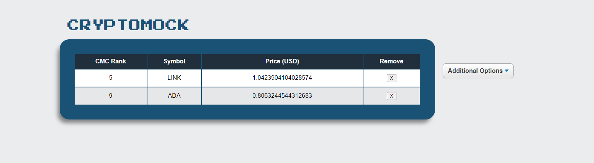

# CRYPTOMOCK

## A simple App displaying cryptocurrencies  


## Want to Try?

Click [Here!](https://crypto-mock.netlify.app/)

Netlify not working? (it does that sometimes...)

Run this in your command line

```
git clone https://github.com/Brendan-G5/crypto-mock.git

cd crypto-mock

npm i

npm start

```


## How to use it?

1. The app starts with the top 5 cryptocurrencies as ranked by Coin Market Cap (CMC), and includes a dropdown menu containing number 6-10 as ranked by CMC.



2. Selecting the dropdown menu allows to to select a currency to be added to the table.



3. You can add up to all 10.



4. Clicking the remove button removes that currency and places it back on the dropdown list.



## Tech

This was made with React (create-react-app), using Redux for state managment. 

## Improvements

- This app could have way more features, more than 10 currencies, visual representation of the price... etc
